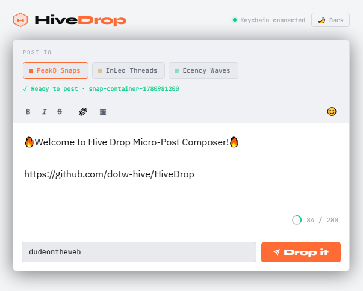
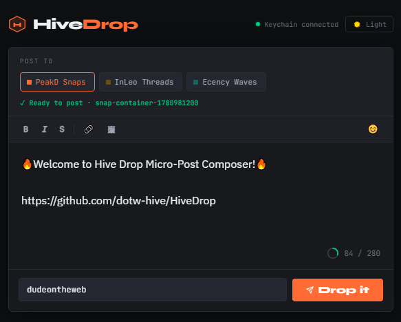

# HiveDrop

**A single-file micro-post composer for PeakD Snaps, InLeo Threads, and Ecency Waves.**

HiveDrop lets you fire off a thought to any of Hive's micro-blogging platforms without leaving your own environment. No logins, no platform UI, no distractions. Just write and drop it.

---

## What it is

Hive's short-form platforms — PeakD Snaps, InLeo Threads, and Ecency Waves — each run on the same underlying mechanic: your posts are comments on a container post managed by the platform's dedicated account. HiveDrop handles all of that behind the scenes. Pick your platform, write your post, hit **Drop it**.

---

## Screenshots

| Light Mode | Dark Mode |
|---|---|
|  |  |

## Features

- **Three platforms in one tool** — PeakD Snaps, InLeo Threads, and Ecency Waves
- **Per-platform character limits** — 280 / 130 / 250 respectively, with a live arc counter
- **Dynamic container fetch** — always finds the active container before posting, no hardcoded permlinks
- **Correct per-platform metadata** — each broadcast matches the native app's transaction format exactly
- **Hive Keychain signing** — your private keys never touch HiveDrop
- **Basic formatting** — bold, italic, strikethrough, link, image insert
- **Emoji picker** — built-in, no CDN required
- **Light and dark mode** — ships dark, toggleable
- **Single file, no dependencies** — one HTML file, no npm, no build step, no framework
- **Transaction link** — every successful post links to [hive.ausbit.dev](https://hive.ausbit.dev) for verification

---

## How to use it

HiveDrop is a single HTML file. There is no install.

1. Download `hivedrop.html`
2. Serve it from any static host — GitHub Pages, Netlify, Cloudflare Pages, or a local server like XAMPP
3. Open it in a Chromium-based browser with the [Hive Keychain](https://chrome.google.com/webstore/detail/hive-keychain/jcacnejopjdphbnjgfaaobbfafkihpep) extension installed
4. Select your platform, write your post, enter your Hive username, and hit **Drop it**

> **Note:** Hive Keychain does not inject into `file://` pages. You need to serve the file over `http://` or `https://` — even a local server works.

---

## Requirements

- A Chromium-based browser (Brave, Chrome, Edge)
- [Hive Keychain](https://chrome.google.com/webstore/detail/hive-keychain/jcacnejopjdphbnjgfaaobbfafkihpep) browser extension
- A Hive account with posting key access via Keychain

Firefox is also supported via the [Keychain Firefox add-on](https://addons.mozilla.org/en-US/firefox/addon/hive-keychain/).

---

## Supported platforms

| Platform | Container account | Community | Char limit |
|---|---|---|---|
| PeakD Snaps | `peak.snaps` | `hive-124838` | 280 |
| InLeo Threads | `leothreads` | `hive-167922` | 130 |
| Ecency Waves | `ecency.waves` | `hive-125125` | 250 |

---

## Sister project

HiveDrop is part of the [dotw-hive](https://github.com/dotw-hive) open-source toolset for the Hive blockchain.

If you need a full long-form post editor, check out **[HiveWrite](https://github.com/dotw-hive/hivewrite)** — a single-file Markdown editor for publishing full blog posts to Hive.

| | HiveWrite | HiveDrop |
|---|---|---|
| Format | Long-form Markdown posts | Micro-posts |
| Vibe | Ink & paper | Signal & fire |
| Use it when | You're writing | You're posting |

---

## Security

- Private keys never touch HiveDrop — all signing is handled by Hive Keychain
- All URLs inserted via the formatting toolbar are sanitized through a scheme whitelist (`http:`, `https:`, `ipfs:`, `hive:`)
- All attribute values are escaped before DOM insertion

---

## License

MIT — do whatever you want with it.

---

*Built by [@dudeontheweb](https://peakd.com/@dudeontheweb) · Part of the [dotw-hive](https://github.com/dotw-hive) project*
